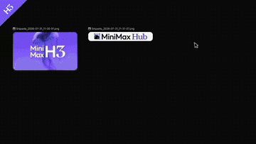
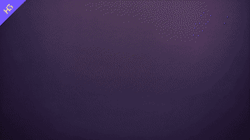

<div align="center">
  
</div>

<p align="center">
  <a href="https://hailuoai.video" target="_blank"></a>
  <a href="https://platform.minimax.io/docs/guides/text-generation" target="_blank"></a>
  <a href="https://www.minimax.io" target="_blank"></a>
  <a href="https://github.com/MiniMax-AI/MiniMax-H3" target="_blank"></a>
  <a href="https://huggingface.co/MiniMaxAI/MiniMax-H3" target="_blank"></a>
  <br>
  <a href="https://modelscope.cn/organization/minimax" target="_blank" rel="noopener noreferrer"></a>
  <a href="https://platform.minimaxi.com/docs/faq/contact-us" target="_blank"></a>
  <a href="https://discord.com/invite/dbMxutw7tP" target="_blank"></a>
  <a href="https://huggingface.co/MiniMaxAI/MiniMax-H3/blob/main/LICENSE"></a>
</p>

<p align="center">
  <a href="README.md">English</a> |
  <a href="README.zh-CN.md"><strong>简体中文</strong></a> |
  <a href="README.ko.md">한국어</a> |
  <a href="README.ja.md">日本語</a>
</p>

# MiniMax H3

## 提示词编写技能

安装 H3 提示词编写技能。这是本仓库内置的九个技能之一：

```bash
npx skills add https://github.com/MiniMax-AI/MiniMax-H3 --skill h3-prompt-writing
```

该技能在 `skills/h3-prompt-writing/references/` 下提供两份提示词指南：`base-en.txt` 用于文本/关键帧模式，`ref-en.txt` 用于全参考（Ref2VA）模式。

**智能体兼容性：** `h3-prompt-writing` 是一个纯 Markdown + 参考文件技能，不调用任何外部 API，因此可在 Claude Code、Claude Agent SDK、Cursor、Windsurf、基于 OpenAI 的智能体/Codex、LangChain，以及任何能够读取 `SKILL.md` 和本地文件的运行环境中使用。内置的 `skills/h3-prompt-writing/agents/openai.yaml` 仅按照 [OpenAI 的技能规范](https://learn.chatgpt.com/docs/build-skills) 提供可选的 ChatGPT/Codex 界面元数据（显示名称、描述、默认提示词），并不会将该技能限制为仅适用于 OpenAI 智能体。

其余八个是面向 MiniMax Hub 画布工作流（`hub_generate_video`、`hub_generate_image`、画布节点、选择卡片等）构建的特定风格视频生成技能，无法移植到通用智能体运行环境：

<table align="center">
  <tr>
    <td align="center"><br><a href="skills/minimalist-product-ad-generator/SKILL.md">minimalist-product-ad-generator</a></td>
    <td align="center"><br><a href="skills/3d-animation-short-generator/SKILL.md">3d-animation-short-generator</a></td>
    <td align="center"><br><a href="skills/papercraft-stop-motion-explainer/SKILL.md">papercraft-stop-motion-explainer</a></td>
    <td align="center"><br><a href="skills/brand-promo-video-generator/SKILL.md">brand-promo-video-generator</a></td>
  </tr>
  <tr>
    <td align="center"><br><a href="skills/music-video-subtitle-generator/SKILL.md">music-video-subtitle-generator</a></td>
    <td align="center"><br><a href="skills/co-op-game-intro-generator/SKILL.md">co-op-game-intro-generator</a></td>
    <td align="center"><br><a href="skills/paper-collage-explainer-generator/SKILL.md">paper-collage-explainer-generator</a></td>
    <td align="center"><br><a href="skills/handdrawn-live-video-generator/SKILL.md">handdrawn-live-video-generator</a></td>
  </tr>
</table>

## 在线 API
通过 API 直接使用 MiniMax\-H3。
- Global: [platform\.minimax\.io](https://platform.minimax.io/docs/api-reference/video-generation-v2-create) \| CN: [platform\.minimaxi\.com](https://platform.minimaxi.com/docs/api-reference/video-generation-v2-create)

## 在线应用
通过应用直接使用 MiniMax\-H3。
- WebApp Global: [hailuoai\.video](https://hailuoai.video/tools/minimax-h3) \| CN: [hailuoai\.com](https://hailuoai.com/)
- Desktop Global: [hub\.minimax\.io](https://hub.minimax.io/) \| CN: [hub\.minimaxi\.com](https://hub.minimaxi.com/)


## 系统概览
MiniMax H3 是一个通用全模态生成系统。它支持对由文本、图像、视频和音频组成的多模态上下文进行统一理解，并可生成最高 2K 分辨率、最长 15 秒、带原生立体声音频的视频。得益于面向任务泛化的系统设计，H3 在预训练阶段已经具备广泛的多模态上下文理解与生成能力，能够出色地遵循复杂的多模态指令。

H3 支持以下输入和输出规格：

| 类别 | 规格 |
|---|---|
| 输出时长 | 4–15 秒 |
| 输出宽高比 | 支持多种宽高比，包括但不限于 21:9、16:9、4:3、1:1、3:4 和 9:16 |
| 输出分辨率 | 支持多种分辨率尺寸。默认短边为 768 像素。可通过 H3-Regenerate-2K 实现 2K 生成 |
| 输出帧率 | 24 FPS |
| 输出音频 | 32 kHz 立体声 |
| 支持的对话语言 | 稳定支持 11 种语言：阿拉伯语、中文、英语、法语、德语、意大利语、日语、韩语、葡萄牙语、俄语和西班牙语。其他语言也有不同程度的支持 |

### 模型变体和输入规格

| 模型变体 | 输入模式 | 规格 |
|---|---|---|
| H3-Base-FL2VA | 首尾帧模式 | 支持零张、一张或两张输入图像。<br><br>- 无图像输入：文生视频模式<br>- 一张图像输入：首帧生视频或尾帧生视频<br>- 两张图像输入：首尾帧生视频 |
| H3-Base-Ref2VA | 全参考模式 | 支持多模态参考输入：<br><br>- **图像：** ≤ 9 张<br>- **视频：** ≤ 3 段；每段 2–15 秒；总时长 ≤ 15 秒<br>- **音频：** ≤ 3 段；音频必须与图像或视频输入一起使用，不能作为唯一输入；每段 2–15 秒；总时长 ≤ 15 秒<br>- **混合输入：** 所有输入类型的文件总数最多为 12 个 |


完整的 H3 系统由以下三个模块组成：
- H3-Context-IR：随着输入变得越来越复杂，我们构建了一个专用系统，用于深入理解和细化输入的多模态指令，并将其转换为 H3 易于理解的形式，即用于生成的上下文中间表示。**H3-Context-IR 对最终输出质量至关重要，因此我们强烈建议将其纳入你的生成流水线，或按照“提示词指导”构建自己的上下文处理系统。**
- H3-Base：基于 H3-Context-IR 的输出生成音频和视频，产出 768p 分辨率结果。
- H3-Regenerate-2K：将 768p 结果与原始上下文一起送回 H3，重新生成 2K 分辨率输出。该过程同时利用 H3 强大的生成能力和原始上下文中的丰富信息，从而生成细节更准确、视觉保真度更高的高分辨率结果。

## 模型架构

### H3\-Context\-IR

H3\-Context\-IR 是一个托管式预处理与编排系统，面向自由形式的多模态输入设计。

它会解析文本、图像、音频和参考视频之间的关系，以及这些素材与目标生成结果之间的关系。其内部流程包括指令解析、跨模态关联、时间理解和复杂逻辑推理。

H3\-Context\-IR 会将其对上下文的理解序列化为 H3\-Base 可接受的结构化表示。在不偏离用户原始意图的前提下，它也会在适当情况下补充缺失或描述不足的语义细节。

由于 H3\-Context\-IR 依赖多阶段工作流以及多个托管模型和服务，本次开源版本不包含该模块。我们提供 API，帮助用户复现官方工作流的行为。我们也提供了详细教程，开发者可以按照 **提示词指导** 构建自己的预处理系统。

详细使用说明请参阅 **推荐工作流 - 完整 2K 工作流**。

**安全防护机制**

用户提交的文本、图像和视频以及增强后的提示词都会经过自动审核。涉嫌违法、色情或侵犯第三方权利的内容可能会被拦截。我们采用行业标准的过滤措施，但无法完全消除误判或漏判。这些防护机制不影响被许可方在 MiniMax H3 Community License 下的义务，尤其是与合法使用和使用限制相关的义务。

### H3\-Base


#### 架构概览

- H3\-Base 使用对应的编码器或 VAE 对不同模态进行编码，并将编码后的表示组织为统一打包的多模态序列。在整个序列输入 H3\-Omni\-Transformer 之前，系统使用 RoPE 捕获 token 之间必要的空间和时间关系。

- 具体而言，文本由 H3\-Encoder 编码；视觉输入由 H3\-Encoder 和 H3\-VisualVAE 共同编码；音频仅由 H3\-AudioVAE 编码。

- H3\-Omni\-Transformer 联合预测视频和音频 latent，随后分别解码为视频和立体声音频。

- 为降低长多模态序列的计算成本，H3 原生支持稀疏注意力训练和推理。初始开源版本仅提供全注意力推理。我们的稀疏注意力实现将在后续更新中发布。

#### H3\-Encoder

- H3\-Encoder 使用 Qwen3\-VL\-32B 的完整预训练权重，并将其第 50 层的隐藏状态提供给 H3\-Omni\-Transformer。

- 我们在 tokenizer 配置中添加了若干特殊 token，例如 `<d>`。使用 H3 时，需要使用 H3 仓库中提供的 tokenizer 及相关配置文件。

#### H3\-VAE

H3 使用独立的视觉 latent 和音频 latent 来表示各自的模态。

##### H3\-VisualVAE

- H3\-VisualVAE 是一个时间因果视频自编码器，空间压缩因子为 16×，时间压缩因子为 4×，latent 通道数为 24，记作 f16t4d24。我们应用了多种 latent 空间优化技术，以同时提升重建质量和 latent 可学习性。

- 在输入 H3\-Omni\-Transformer 之前，视觉 latent 会沿 `(time, height, width)` 维度以 `1 × 2 × 2` 的 patch size 进一步 patchify。因此，进入 Transformer 的视觉 token 具有 32× 的有效空间下采样因子，而时间下采样因子保持为 4×。

- H3\-VisualVAE 的 latent 空间同时针对重建质量和生成模型的学习便利性进行优化。在训练其编码器之后，我们额外训练了一个基于 ViT 的解码器，以降低解码成本并进一步提升重建质量。

##### H3\-AudioVAE

- H3-AudioVAE 对左右声道使用相同的编码器和解码器，同时独立处理每个声道。解码后的声道随后重新合并，从而支持立体声音频输入和输出。
- 对每个声道，H3-AudioVAE 将 32 kHz 音频压缩为时间率为 40 Hz 的 latent token 序列。
- 受 VA-VAE 启发，我们优化 latent 空间，使其在保持音频重建质量的同时更易于生成模型学习。

#### H3\-Omni\-Transformer

- 为了可扩展性和泛化能力，我们采用了相对简洁的 Transformer block 设计。H3\-Omni\-Transformer 是一个 33B 参数的稠密单流 Transformer，其中约 13B 参数位于 AdaLN 相关分支。由于 AdaLN 调制输出可以预先计算并缓存，纯推理部署时无需加载这些参数。我们发布完整模型权重，以支持包括微调在内的进一步开发。

- 注意力层和 FFN 层都不包含模态特定结构。模态特定参数仅限于输入/输出层和 AdaLN 分支。尤其是模态特定 AdaLN 能以较低的额外训练和推理成本提升生成质量。

- 模型使用三维多模态旋转位置编码（MM\-RoPE）来表示时间维和两个空间维 `(t, h, w)` 上的位置关系。

- 在训练的最后阶段，我们引入原生稀疏注意力，以降低长序列的计算成本。稀疏注意力实现未包含在初始开源版本中，将在后续更新中单独发布。

    

### H3-Regenerate-2K

- 对于 H3 的 2K 分辨率输出，我们没有使用传统的专用超分辨率模块，而是让 H3 base model 以 in-context 方式重新生成其低分辨率结果。

- 这种方法有两个优势：（1）重生成过程可以最大程度复用 H3 base model 的生成能力；（2）in-context 格式在生成高分辨率输出时可以复用原始多模态上下文，从而恢复传统超分辨率方法通常只能“猜测”的信息，例如小文字和精细细节。

- In-context 重生成也是任务泛化的一个例子。

- **由于系统复杂度较高，该模块尚未开源。我们会在准备就绪后发布。** 我们提供了用于验证官方结果的 API；请参阅下方“完整 2K 工作流”。


## 推荐工作流

为了帮助社区正确部署 MiniMax H3，我们提供了两种验证方法。

由于完整的 H3 系统由 H3\-Context\-IR、H3\-Base 和 H3\-Regenerate\-2K 三个模块组成，“完整 2K 工作流”提供了一个用于 2K 输出的端到端验证流水线，将开放平台 API 与本地部署的 H3\-Base 结合使用。“H3\-Base 本地部署”部分则提供了仅使用本地部署 H3\-Base 验证 768p 输出的方法。

此外，“提示词指导”部分提供了详细教程，帮助社区开发自己的提示词系统。

### H3\-Base 本地部署

MiniMax H3 以两个任务特定 checkpoint 形式发布。每个 checkpoint 都包含一个专用 Omni Transformer Model，以及所需的 processor、tokenizer、text encoder、Visual VAE 和独立 Audio VAE 组件。

|Checkpoint|支持任务|输入条件|输出|精度|
|---|---|---|---|---|
|MiniMax\-H3 Base FL2VA|文生音视频（`t2va`）、首帧/尾帧生音视频（`fl2va`）|文本；可选首帧、尾帧或两者|视频和音频|BF16|
|MiniMax\-H3 Base Ref2VA|参考输入生音视频（`ref2va`）|文本以及参考图像、视频和/或音频|视频和音频|BF16|

发布的 checkpoint 是经过 CFG 蒸馏的 Omni Transformer 模型权重。

每个 checkpoint 都以自包含的 Hugging Face 风格仓库形式分发，包含以下组件：

```text
<TASK>/
├── model_index.json
├── processor/
├── tokenizer/
├── text_encoder/
├── transformer/
├── visual_vae/
└── audio_vae/
```

下载模型。仓库同时托管原始 checkpoint（`FL2VA/`、`Ref2VA/`）和 diffusers 格式，因此请按你的框架需求限定下载范围：

`model_index.json` 是仓库级公开入口。特定任务族的 diffusers 索引仍位于 `FL2VA/model_index.json` 和 `Ref2VA/model_index.json`。

```bash
# Original checkpoint, both task families (SGLang, vLLM):
hf download MiniMaxAI/MiniMax-H3 --include "model_index.json" "FL2VA/*" "Ref2VA/*" --local-dir MiniMax-H3

# Or a single task family:
hf download MiniMaxAI/MiniMax-H3 --include "model_index.json" "FL2VA/*" --local-dir MiniMax-H3
```

diffusers 用户无需手动下载：`ModularPipeline.from_pretrained("MiniMaxAI/MiniMax-H3")` 会准确拉取所需组件。加载方法请参阅 [diffusers documentation](https://github.com/huggingface/diffusers/blob/minimax-h3/docs/source/en/api/pipelines/minimax_h3.md)。

我们推荐使用以下推理框架来服务模型：

- [SGLang](https://docs.sglang.io/) \- see [cookbook](https://docs.sglang.io/cookbook/diffusion/MiniMax/MiniMax-H3) 

- [vLLM](https://github.com/vllm-project/vllm) \- see [vllm recipes](https://recipes.vllm.ai/MiniMaxAI/MiniMax-H3)

- [diffusers](https://github.com/huggingface/diffusers) \- see [diffusers docs](https://github.com/huggingface/diffusers/blob/minimax-h3/docs/source/en/api/pipelines/minimax_h3.md)

- [ComfyUI](https://github.com/Comfy-Org/ComfyUI) \- see  [Comfy tutorial](https://docs.comfy.org/tutorials/video/minimax/minimax-h3); use [R2V template](https://github.com/Comfy-Org/workflow_templates/blob/main/templates/video_minimax_h3_r2v.json) / [T2V template](https://github.com/Comfy-Org/workflow_templates/blob/main/templates/video_minimax_h3_t2v.json)

#### Sglang 部署

这里以 sglang 作为部署示例。更多部署配置请参阅 [MiniMax\-H3 deployment guide](https://docs.sglang.io/cookbook/diffusion/MiniMax/MiniMax-H3#3-serve-minimax-h3)。

FL2VA:

```bash
sglang serve \
  --model-path MiniMaxAI/MiniMax-H3 \
  --num-gpus 4 \
  --ulysses-degree 4 \
  --performance-mode speed \
  --host 0.0.0.0 \
  --port 30010 \
  --model-variant fl2va
```

Ref2VA:

```bash
sglang serve \
  --model-path MiniMaxAI/MiniMax-H3 \
  --num-gpus 4 \
  --ulysses-degree 4 \
  --performance-mode speed \
  --host 0.0.0.0 \
  --port 30011 \
  --model-variant ref2va
```

#### 可复现的 768p 示例

以下三个用例 T2VA、FL2VA 和 Ref2VA 展示了如何复现 MiniMax\-H3 音视频生成。

| 用例 | 请求 | 结果 |
|---|---|---|
| T2VA | [查看脚本](scripts/readme/reproducible-768p-t2va-request.sh) | [t2va.mp4](assets/t2va.mp4) |
| FL2VA | [查看脚本](scripts/readme/reproducible-768p-fl2va-request.sh) | [fl2va.mp4](assets/fl2va.mp4) |
| Ref2VA | [查看脚本](scripts/readme/reproducible-768p-ref2va-request.sh) | [ref2va.mp4](assets/ref2va.mp4) |

### 完整 2K 工作流

本节说明如何将本地部署的 SGLang 服务与官方 **H3\-Context\-IR** 和 **H3\-Regenerate\-2K** API 结合使用，以复现直接通过 MiniMax API 生成的 2K 视频质量。
开始之前，请配置 SGLang endpoint 和 MiniMax API 凭证：

```bash
# URL of your SGLang deployment
SGLANG_DEPLOYMENT_URL="<sglang-deployment-url>"

# MiniMax API endpoint (choose one)
# CN
MINIMAX_API_BASE="https://api.minimaxi.com"
# Global
# MINIMAX_API_BASE="https://api.minimax.io"

# API token obtained from the MiniMax platform
TOKEN="<token>"
```

MiniMax 平台：

API 文档：
- 创建 H3-2K：使用 /video-generation-v2-create [EN-docs](https://platform.minimax.io/docs/api-reference/video-generation-v2-create)，[CN-docs](https://platform.minimaxi.com/docs/api-reference/video-generation-v2-create)
- H3-Context-IR：使用 /video-generation-v2-h3-context-ir [EN-docs](https://platform.minimax.io/docs/api-reference/video-generation-v2-h3-context-ir)，[CN-docs](https://platform.minimaxi.com/docs/api-reference/video-generation-v2-h3-context-ir)
- H3-Regenerate-2K：使用 /video-generation-v2-regeneration [EN-docs](https://platform.minimax.io/docs/api-reference/video-generation-v2-regeneration)，[CN-docs](https://platform.minimaxi.com/docs/api-reference/video-generation-v2-regeneration)


以下示例会将本地 H3\-Base 输出文件编码为 Base64 Data URL。生产环境建议将视频上传到可公开访问的 URL，并将该 URL 作为 `base_video` 传入。

对于下方每个案例，我们都提供了直接通过开放平台 API 生成的 2K 和 768p 参考输出，便于验证结果。

#### case\-T2VA

- 类型：文生视频
- 时长：10 秒
- 宽高比：16:9

<table>
  <thead>
    <tr><th>阶段</th><th>请求</th><th>结果</th></tr>
  </thead>
  <tbody>
    <tr><td>H3-Context-IR</td><td><a href="scripts/readme/full-2k-t2va-h3-context-ir.sh">查看脚本</a></td><td><pre><code class="language-json">{
  &quot;task&quot;: {
    &quot;id&quot;: &quot;&lt;task_id&gt;&quot;,
    &quot;model&quot;: &quot;MiniMax-H3&quot;,
    &quot;status&quot;: &quot;succeeded&quot;,
    &quot;created_at&quot;: &quot;&lt;created_at&gt;&quot;,
    &quot;updated_at&quot;: &quot;&lt;updated_at&gt;&quot;,
    &quot;content&quot;: {
      &quot;prompt&quot;: &quot;integrated_multimodal_description: [Shot 1] Cinematic, medium wide shot, pushing in slowly. In the cavernous, dimly lit bridge of a starship, sleek metallic consoles with glowing amber displays flank a massive, curved observation window. A female captain, in her late 40s with an athletic build and short silver-streaked black hair, stands in the center midground. She wears a structured, high-collared dark navy military tunic with silver chest insignias. Her back is to the camera, silhouetted against the cool, ambient starlight pouring through the thick glass. She stands perfectly still with her hands clasped tightly behind her back. Outside the window, a massive armada of jagged, dark grey dreadnoughts hovers in tight formation against a deep purple space nebula. The fleet&#39;s massive rear thrusters begin to glow with an intense, escalating bright blue light. [Shot 2] At 00:04.500, the camera cuts to a close-up of the captain&#39;s face and shakes strongly. The brilliant blue-white light from the fleet&#39;s gathering energy reflects vividly in her dark eyes. Suddenly, a blinding white flash floods through the window, completely washing out the background as the fleet jumps to hyperspace. The sheer spatial force violently jolts the bridge, causing the captain from Shot 1 to stagger slightly forward, her shoulders tensing as she visibly braces herself against the physical tremors. As the intense white light fades abruptly, leaving only the dim, empty expanse of the purple nebula reflected on her starkly lit skin, her jaw clenches, and she slowly closes her eyes in the newly emptied space.\noverall_soundscape: A low, resonant hum of the ship&#39;s ambient life support systems serves as the baseline, soon drowned out by an audible, escalating, high-pitched electronic whine as the fleet outside charges its hyperdrives. A massive, deafening, bass-heavy boom and sharp crackle erupts during the blinding flash, accompanied by the loud metallic creaking, rattling, and deep thuds of the bridge&#39;s bulkheads vibrating under immense physical stress. The intense roaring impact then cuts abruptly back to a hollow, echoing room tone, leaving only the faint, steady hum of the isolated bridge.\nnon_diegetic_music: Cinematic space-opera orchestral score, slow tempo, featuring a solitary, mournful French horn melody over deep, sustained string dissonances that build rapidly in volume and intensity, swelling to a massive orchestral peak before snapping immediately into silence right after the jump.&quot;
    },
    &quot;duration&quot;: 10,
    &quot;usage&quot;: {
      &quot;total_tokens&quot;: 8565,
      &quot;prompt_tokens&quot;: 5650,
      &quot;completion_tokens&quot;: 2915
    },
    &quot;ratio&quot;: &quot;16:9&quot;,
    &quot;task_type&quot;: &quot;h3_context_ir&quot;,
    &quot;modality&quot;: &quot;text&quot;
  }
}</code></pre></td></tr>
    <tr><td>H3-Base</td><td><a href="scripts/readme/full-2k-t2va-h3-base.sh">查看脚本</a></td><td><a href="assets/t2va.mp4">t2va.mp4</a></td></tr>
    <tr><td>H3-Regenerate-2K</td><td><a href="scripts/readme/full-2k-t2va-h3-regenerate-2k.sh">查看脚本</a></td><td><a href="assets/t2va_2k.mp4">t2va_2k.mp4</a></td></tr>
    <tr><td>直接调用开放平台 API 的 2K 参考结果</td><td><a href="scripts/readme/full-2k-t2va-reference-2k-result-by-directly-calling-open-platform-api.sh">查看脚本</a></td><td><a href="assets/h3_direct_2k.mp4">h3_direct_2k.mp4</a></td></tr>
    <tr><td>直接调用开放平台 API 的 768P 参考结果</td><td><a href="scripts/readme/full-2k-t2va-reference-768p-result-by-directly-calling-open-platform-api.sh">查看脚本</a></td><td><a href="assets/h3_direct_768p.mp4">h3_direct_768p.mp4</a><br></td></tr>
  </tbody>
</table>

#### case\-I2VA

- 类型：首帧图生视频
- 时长：8 秒
- 宽高比：自适应

<table>
  <thead>
    <tr><th>阶段</th><th>请求</th><th>结果</th></tr>
  </thead>
  <tbody>
    <tr><td>H3-Context-IR</td><td><a href="scripts/readme/full-2k-i2va-h3-context-ir.sh">查看脚本</a></td><td><pre><code class="language-json">{
  &quot;task&quot;: {
    &quot;id&quot;: &quot;&lt;task_id&gt;&quot;,
    &quot;model&quot;: &quot;MiniMax-H3&quot;,
    &quot;status&quot;: &quot;succeeded&quot;,
    &quot;created_at&quot;: &quot;&lt;created_at&gt;&quot;,
    &quot;updated_at&quot;: &quot;&lt;updated_at&gt;&quot;,
    &quot;content&quot;: {
      &quot;prompt&quot;: &quot;For the target video, at 0.00 seconds into the target video, &lt;Picture 1&gt; (from [Shot 1]) is fully referenced.\n\nintegrated_multimodal_description: [Shot 1] This is a live-action, cinematic shot with a shallow depth of field. The camera holds a perfectly static shot throughout the entire eight-second duration, capturing a cozy family gathering in a traditional Japanese dining room. The scene opens with a large, intricately patterned blue and white ceramic bowl of ramen in the immediate foreground, rendered in crisp, sharp focus. The bowl sits on a smooth, polished long wooden table. Inside the bowl, a rich, oily golden-brown broth surrounds yellow wavy noodles, topped with two thick, round slices of chashu pork featuring visible fat marbling and a distinct spiral meat pattern. A generous mound of freshly chopped, bright green scallions rests in the center, and a crisp, dark green rectangular sheet of nori seaweed is tucked into the right edge. To the left of the bowl, a pair of light brown wooden chopsticks rests horizontally on a small, dark rectangular chopstick rest, near a small cylindrical ceramic teacup with blue painted patterns. On the right side of the table, a spherical paper lantern with a ribbed bamboo frame sits on a black wooden base. In the background, a large family of seven is gathered around the table, initially appearing as a soft, blurred presence. Behind them, traditional Japanese sliding shoji screens with wooden lattice frames are open, revealing a bright outdoor scene with lush green trees. Early in the clip, the thick, white steam rising from the hot ramen broth immediately intensifies, billowing upwards in thick, swirling clouds that dance continuously above the bowl. As the clip progresses into the middle seconds, the camera maintains its static position while the focus begins a deliberate, smooth shift deeper into the room. The foreground ramen bowl, its vibrant ingredients, and the rising steam gradually soften into a hazy, out-of-focus blur. Simultaneously, the family members in the background come into sharp, detailed clarity. The heavy steam continues to rise from the foreground, creating a dynamic, translucent veil between the camera and the family. With the focus now firmly locked on the background, the vibrant family dinner comes alive. The man in the dark navy blue long-sleeved shirt on the left leans forward, his mouth moving animatedly in a silent exchange. The young girl in the crisp white short-sleeved t-shirt beside him smiles brightly, looking toward the center of the table. The woman on the far left, wearing a soft light blue long-sleeved blouse, turns her head slightly, smiling gently. Across the table, the woman in the light grey button-down shirt smiles broadly, her eyes crinkling, as she rests her hands near her plate. The woman in the dark grey top further back uses her wooden chopsticks to pick up a small piece of food from a central ceramic dish filled with bright red pickled vegetables. The woman in the center back in the light grey sweater smiles gently, her hands clasped softly in front of her, observing the interaction. Throughout the remainder of the clip, the family continues their lively physical interaction, their mouths moving in continuous, silent cadences of conversation, while the thick, white steam from the blurred ramen bowl in the foreground never stops rising, adding a comforting atmosphere to the warm gathering.\n\noverall_soundscape: The soundscape begins with a quiet room tone mixed with the faint, airy rustle of the thick steam billowing from the hot ramen bowl in the foreground, accompanied by the subtle, continuous hissing and bubbling of the rich broth. As the visual focus shifts deeper into the room, the physical sounds of the bustling family dinner become dominant in the foreground. The clear, sharp clinking of ceramic bowls and wooden chopsticks touching plates is clearly heard as the family members reach for food. This is followed by the faint, muffled thud of a cup being set down on the smooth wooden table, and the subtle, rhythmic rustle of cotton and wool clothing as the family members lean forward and gesture, perfectly capturing the lively, physical atmosphere of the shared meal.\n\nnon_diegetic_music: A gentle, heartwarming acoustic guitar melody plays softly in the background, accompanied by the subtle, resonant notes of a traditional Japanese koto. The music maintains a slow, comforting tempo that enhances the cozy, nostalgic, and joyful atmosphere of the family gathering.&quot;
    },
    &quot;duration&quot;: 8,
    &quot;usage&quot;: {
      &quot;total_tokens&quot;: 22822,
      &quot;prompt_tokens&quot;: 12800,
      &quot;completion_tokens&quot;: 10022
    },
    &quot;ratio&quot;: &quot;16:9&quot;,
    &quot;task_type&quot;: &quot;h3_context_ir&quot;,
    &quot;modality&quot;: &quot;text&quot;
  }
}</code></pre></td></tr>
    <tr><td>H3-Base</td><td><a href="scripts/readme/full-2k-i2va-h3-base.sh">查看脚本</a></td><td><a href="assets/i2va.mp4">i2va.mp4</a></td></tr>
    <tr><td>H3-Regenerate-2K</td><td><a href="scripts/readme/full-2k-i2va-h3-regenerate-2k.sh">查看脚本</a></td><td><a href="assets/i2va_2k.mp4">i2va_2k.mp4</a><br></td></tr>
    <tr><td>直接调用开放平台 API 的 2K 参考结果</td><td><a href="scripts/readme/full-2k-i2va-reference-2k-result-by-directly-calling-open-platform-api.sh">查看脚本</a></td><td><a href="assets/i2va_direct_2k.mp4">i2va_direct_2k.mp4</a></td></tr>
    <tr><td>直接调用开放平台 API 的 768P 参考结果</td><td><a href="scripts/readme/full-2k-i2va-reference-768p-result-by-directly-calling-open-platform-api.sh">查看脚本</a></td><td><a href="assets/i2va_direct_768p.mp4">i2va_direct_768p.mp4</a></td></tr>
  </tbody>
</table>

#### case\-Ref2VA

- 类型：多模态参考生视频（视频 + 音频）
- 时长：5 秒
- 宽高比：自适应

<table>
  <thead>
    <tr><th>阶段</th><th>请求</th><th>结果</th></tr>
  </thead>
  <tbody>
    <tr><td>H3-Context-IR</td><td><a href="scripts/readme/full-2k-ref2va-h3-context-ir.sh">查看脚本</a></td><td><pre><code class="language-json">{
  &quot;task&quot;: {
    &quot;id&quot;: &quot;&lt;task_id&gt;&quot;,
    &quot;model&quot;: &quot;MiniMax-H3&quot;,
    &quot;status&quot;: &quot;succeeded&quot;,
    &quot;created_at&quot;: &quot;&lt;created_at&gt;&quot;,
    &quot;updated_at&quot;: &quot;&lt;updated_at&gt;&quot;,
    &quot;content&quot;: {
      &quot;prompt&quot;: &quot;subject_definitions:\n&lt;Subject 1&gt; is the young man with short wavy blonde hair, wearing a bright pink suit jacket, matching pink trousers, an unbuttoned white shirt, and silver rings, holding a small black lamb in his arms in &lt;Video 1&gt;.\n&lt;Video 1&gt; is the source video for the editing task.\n&lt;Audio 1&gt; is the synchronized audio track of &lt;Video 1&gt;, providing the background music.\n&lt;Audio 2&gt; is the voice timbre reference for &lt;Subject 1&gt;&#39;s voice, containing a spoken male voiceover.\n\nsummary:\n[video editing + audio reference + audio reuse] The target video is an edited version of &lt;Video 1&gt;. &lt;Subject 1&gt;, wearing a bright pink suit and holding a black lamb, stands in a grassy field with other white lambs in the background. The edit animates &lt;Subject 1&gt;&#39;s face to speak the user-provided dialogue. &lt;Audio 1&gt; is partially reused as the continuous background music, while the target references the calm male voice timbre of &lt;Audio 2&gt; for &lt;Subject 1&gt;&#39;s spoken lines.\n\nretention_analysis:\n&lt;Subject 1&gt; (appears in [Shot 1]): fully_preserved - the man retains his identity, wavy blonde hair, pink suit, white shirt, accessories, and the black lamb he holds, with his mouth newly animated to speak.\n&lt;Video 1&gt; (source video editing): fully_preserved - the original camera framing, warm golden hour lighting, grassy hill setting, and background white lambs are maintained while the central character is edited.\n&lt;Audio 1&gt;: partially_copy - the atmospheric background music from &lt;Audio 1&gt; is reused in the target video, mixed beneath the newly added spoken dialogue.\n&lt;Audio 2&gt;: reference - the target audio references the male voice timbre from &lt;Audio 2&gt; to generate &lt;Subject 1&gt;&#39;s spoken dialogue.\n\ndetailed_description:\nThe target video is in realistic photographic style.\n[Shot 1] The shot begins from the source &lt;Video 1&gt;, showing &lt;Subject 1&gt;, a young man with short wavy blonde hair, wearing a bright pink suit jacket, matching pink trousers, and a casually unbuttoned white shirt. He stands confidently in a sunlit green pasture, gently holding a small black lamb securely in his arms. The warm, golden hour lighting casts soft shadows across his face and the bright pink fabric of his suit. Behind him, several white lambs stand and graze on the rolling grassy hill against a clear, pale blue sky. The atmospheric background music from &lt;Audio 1&gt; plays continuously throughout the scene. &lt;Subject 1&gt; physically speaks, his mouth movements naturally syncing to the new dialogue, with his voice timbre referencing the calm male delivery from &lt;Audio 2&gt;. Looking thoughtfully forward, &lt;Subject 1&gt; (S1) speaks softly, &lt;d&gt;[English] Follow the wind, live free.&lt;/d&gt; As he delivers the line, he subtly shifts his weight, cradling the resting black lamb while the camera slowly pushes in. &lt;Subject 1&gt; (S1) continues his thought, &lt;d&gt;[English] Leave worries behind, enjoy the moment.&lt;/d&gt; Exactly as his voice stops, his lips meet in a relaxed, peaceful smile, and his jaw ceases speaking motion. He then turns his gaze slightly away toward the horizon, gently stroking the black lamb&#39;s fleece with his fingers as the camera holds on this tranquil, sunlit state through the end of the video.\n\noverall_soundscape:\nThe soundscape consists of the continuous, atmospheric background music from &lt;Audio 1&gt;, overlaid with the clear, calm male dialogue spoken by the main character, referencing the voice timbre of &lt;Audio 2&gt;.\n\nnon_diegetic_music:\nThe atmospheric, sustained background music from &lt;Audio 1&gt; is reused as the continuous score, playing quietly beneath the spoken dialogue.&quot;
    },
    &quot;duration&quot;: 5,
    &quot;usage&quot;: {
      &quot;total_tokens&quot;: 39299,
      &quot;prompt_tokens&quot;: 33323,
      &quot;completion_tokens&quot;: 5976
    },
    &quot;ratio&quot;: &quot;16:9&quot;,
    &quot;task_type&quot;: &quot;h3_context_ir&quot;,
    &quot;modality&quot;: &quot;text&quot;
  }
}</code></pre></td></tr>
    <tr><td>H3-Base</td><td><a href="scripts/readme/full-2k-ref2va-h3-base.sh">查看脚本</a></td><td><a href="assets/r2va.mp4">r2va.mp4</a><br></td></tr>
    <tr><td>直接调用开放平台 API 的 2K 参考结果</td><td><a href="scripts/readme/full-2k-ref2va-reference-2k-result-by-directly-calling-open-platform-api.sh">查看脚本</a></td><td><a href="assets/r2va_2k.mp4">r2va_2k.mp4</a></td></tr>
    <tr><td>开放平台中的 H3 API 2K 参考结果</td><td><a href="scripts/readme/full-2k-ref2va-h3-api-2k-in-open-platform-for-reference.sh">查看脚本</a></td><td><a href="assets/r2va_direct_2k.mp4">r2va_direct_2k.mp4</a><br></td></tr>
    <tr><td>直接调用开放平台 API 的 768P 参考结果</td><td><a href="scripts/readme/full-2k-ref2va-reference-768p-result-by-directly-calling-open-platform-api.sh">查看脚本</a></td><td><a href="assets/r2va_direct_768p.mp4">r2va_direct_768p.mp4</a><br></td></tr>
  </tbody>
</table>

### 提示词指导

为保持 Markdown 布局简洁，Hugging Face 发布中的提示词指导文档未复制到本仓库。


## 许可证

MiniMax H3 基于 [MiniMax H3 Community License Agreement](https://huggingface.co/MiniMaxAI/MiniMax-H3/blob/main/LICENSE) 发布。

## 联系我们

请通过 [model@minimax.io](mailto:model@minimax.io) 联系我们。
